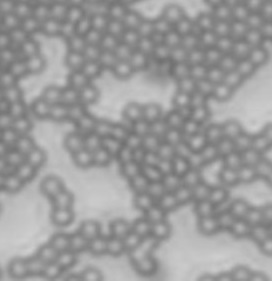
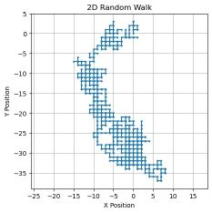
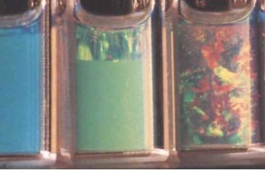
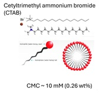

# Soft-Matter-Notes
This is a repository containing notes and projects of the course Soft Condensed Matter Physics that I offered in  August to December 2024 at Azim Premji University, Bangalore
## Course Syllabus
The course gives an overview of different aspects of soft condensed matter systems such as Colloids, Surfactants, Polymers and Liquid crystals. 
### Course description
The course builds on an introductory level knowledge of thermodynamics and statistical physics and the ideas of free energy, entropy and phase behaviour of multicomponent systems. The relevant energy and length scales for soft matter systems and the theory of elasticity and fluid mechanics are introduced briefly wherever relevant. A large class of materials encountered in everyday life such as colloids, surfactants, polymers, surfactants, foams, granular media, gels, monolayers and living matter at different length scales can be classified under soft matter. In this course we restrict ourselves to the first four and examine the physical principles governing the phase behaviour and dynamics of these systems. 

#### COLLOIDS



Colloids are particles with length scales less than 10 $\mu$ m. We begin with the Brownian motion of a single colloidal particle. Following a gentle introduction to Random Walks and Fluctuation-Dissipation theorem, we discuss the  interactions between two colloidal particles.


```r
import numpy as np
import matplotlib.pyplot as plt

# Number of steps
N = 1000

# Initialize starting position
x, y = 0, 0

# Lists to store the x and y coordinates
x_positions = [x]
y_positions = [y]

# Perform the random walk
for _ in range(N):
    step = np.random.choice(['N', 'S', 'E', 'W'])
    if step == 'N':
        y += 1  # Move north
    elif step == 'S':
        y -= 1  # Move south
    elif step == 'E':
        x += 1  # Move east
    elif step == 'W':
        x -= 1  # Move west
    
    # Store the new position
    x_positions.append(x)
    y_positions.append(y)

# Plotting the random walk path
plt.figure(figsize=(10,10))
plt.plot(x_positions, y_positions, marker='o', markersize=2)
plt.title('2D Random Walk')
plt.xlabel('X Position')
plt.ylabel('Y Position')
plt.grid()
plt.axis('equal')
plt.show()

```


Given below is a video of Brownian motion of fat globules in milk.

<iframe width="640" height="480" src="https://youtu.be/2mH6jElY9FI" allowfullscreen></iframe>


 Beginning with electrostatic interactions between molecules we use simple rules of additivity to study the attractive and repulsive forces between macroscopic bodies. Vander waals attraction between macroscopic objects of different geometry (infinite planes, cylinders and spheres), double layer repulsion between surfaces in the presence of an intervening medium, depletion forces and steric repulsion are discussed. These attractive and repulsive forces have a crucial role in stabilizing dispersion of colloidal particles in aqueous or organic solvents.

[Geogebra: Vanderwaals interaction](https://www.geogebra.org/calculator/awzzt7d6)

<font color="green">  ***You may vary the parameters to understand how a minimum in the potential determines the stable distance between the particles***

<font color="white">

 
 An increase in the concentration of colloidal particles in dispersions, they may flocculate or arrange in closely packed arrays to form three dimensional crystals. We will conclude this unit by examining briefly the phase behaviour of hard sphere colloidal crystals stabilized through a delicate balance of hard sphere repulsive forces and the attractive depletion forces.

[Phase Behavior of Concentrated Suspensions of Nearly Hard Colloidal Spheres](https://www.researchgate.net/publication/235678168_Phase_Behavior_of_Concentrated_Suspensions_of_Nearly_Hard_Colloidal_Spheres)



#### SURFACTANTS
The propensity of soft matter systems to self-assemble gives rise to a plethora of complex, ordered structures. We study here the self-assembly of amphiphilic molecules where one part of the molecule has affinity to water and the other part repels water.

 

We begin by considering a regular solution model based on a mean field theory to predict the free energy of mixing of two liquids by considering the interaction and entropy of mixing of two distinct molecules A and B in a 2D or 3D lattice. The free energy can be plotted for different strength of the interaction parameter $\chi$.

$\chi$ may depend on temperature T or the length of the hydrocarbon chain. We also extend this model to estimate the surface tension at an oil water interface. 

[Geogebra: Free energy of mixing of liquids](https://www.geogebra.org/calculator/kdes6d5v)

 Self-assembly of amphiphilic molecules to form finite aggregates termed as micelles is examined in the framework of ideal gases. We write down the partition function for non-interacting aggregates of micelles in solution. For the system in thermodynamic equilibrium, we arrive at the condition for formation of micelles above a certain concentration of the solute, termed as the crical micellar concentration. Through simple geometric arguments we may see that the shape of micellar aggregates is determined by the volume, head group area and chain length of the amphiphile. Geometry further effects the CMC and size of the aggregate. We also study the effect of thermal fluctuations on an infinite bilayer formed by a sheet of amphiphilic molecules

 

We will see that the root mean square amplitude of the membrane fluctuations under vanishing surface tension are typically about 1% of the lateral extension of the membrane. Hence due to thermal undulations, an isolated membrane is not a planar object but highly crumpled.

We conclude this unit by asking what  if micelles interact? Similar to the self-assembly of colloids to form crystals, we now have a self organization in 1D, 2D and 3D to form different phases based on the geometry of the aggregates.


#### POLYMERS
Under construction


 .